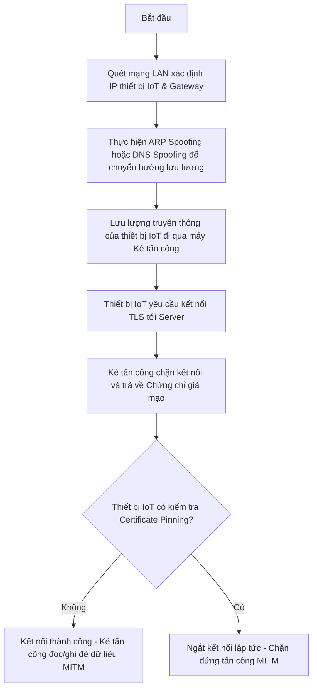

# Đề tài 23: Man-in-the-Middle (MITM) trong IoT và Biện pháp Phòng chống

Báo cáo tiến độ Tuần 02 (Đạt mốc 25% tiến độ dự án)  
Lớp học phần: **INT4410 - Bảo mật trong IoT**

---

## 1. Thông tin sinh viên thực hiện
- **Họ và tên:** Lương Thị Thanh Thanh
- **Email:** luongthanhthanh14082005@gmail.com (mail chính)
- **Đề tài số:** 23
- **Tên đề tài:** Man-in-the-Middle (MITM) trong IoT và phòng chống

---

## 2. Giới thiệu đề tài & Mục tiêu
Tấn công Man-in-the-Middle (MITM - Kẻ đứng giữa) là một trong những mối đe dọa phổ biến nhất đối với các thiết bị IoT truyền thông không an toàn. Khi thiết bị IoT gửi dữ liệu telemetry hoặc nhận lệnh điều khiển từ Cloud mà không xác thực kênh truyền hoặc tin tưởng mù quáng vào các Certificate Authority (CA) công cộng, kẻ tấn công có thể giả mạo để đọc trộm hoặc thay đổi dữ liệu.

**Mục tiêu của đề tài:**
- Nghiên cứu cơ chế tấn công MITM (ARP Spoofing, DNS Spoofing).
- Đề xuất và mô phỏng giải pháp phòng chống bằng **Certificate Pinning (Ghim chứng chỉ)** theo nguyên lý bảo mật của thư viện nhúng chuyên dụng **Mbed TLS** (thường dùng trên các dòng chip IoT ESP32, ARM Cortex-M).

---

## 3. Chuỗi tấn công MITM (Attack Chain)
Kẻ tấn công thực hiện chuỗi hành vi xâm nhập theo các bước sau trong môi trường mạng:

1. **Bước 1 (ARP Spoofing / DNS Spoofing):** Kẻ tấn công gửi các gói tin ARP giả mạo đến Switch/Router hoặc thiết bị IoT để mạo danh Gateway, ép lưu lượng mạng phải đi qua máy của kẻ tấn công.
2. **Bước 2 (Chặn bắt TLS Handshake):** Khi thiết bị IoT khởi tạo phiên kết nối bảo mật HTTPS/TLS đến Server, kẻ tấn công đứng giữa sẽ chặn và đóng vai trò làm Server trung gian để thương lượng khóa.
3. **Bước 3 (Giả mạo chứng chỉ):** Kẻ tấn công gửi một chứng chỉ SSL/TLS giả mạo tự ký (Self-signed) hoặc được ký bởi một CA do kẻ tấn công tự tạo cho thiết bị IoT.
4. **Bước 4 (Khai thác dữ liệu):** Nếu thiết bị IoT không xác thực mã băm chứng chỉ, nó sẽ chấp nhận kết nối. Kẻ tấn công giải mã dữ liệu của IoT gửi lên, sau đó mã hóa lại bằng chứng chỉ thật để chuyển tiếp lên Server thực tế.

---

## 4. Bảng điều kiện khai thác (Exploitation Conditions)
Các yếu tố kỹ thuật và cấu hình giúp kẻ tấn công có thể khai thác thành công lỗ hổng MITM trên thiết bị IoT:

| Điều kiện khai thác | Mô tả chi tiết | Khả năng khắc phục |
| :--- | :--- | :--- |
| **Không xác thực chứng chỉ** | Thiết bị IoT chấp nhận mọi chứng chỉ SSL/TLS từ Server mà không kiểm tra chuỗi ký (Trust Chain) hoặc CA. | Dễ dàng (Cấu hình TLS bắt buộc Verify). |
| **Tin tưởng CA bên thứ ba mù quáng** | Thiết bị tin tưởng bất kỳ Root CA nào trong máy. Kẻ tấn công có thể cài đặt Root CA giả mạo của mình vào thiết bị để vượt qua bước xác thực thông thường. | Trung bình (Sử dụng Certificate Pinning để giới hạn CA cụ thể). |
| **Giao thức truyền thông không mã hóa** | Sử dụng HTTP, MQTT không mã hóa (cổng 1883) thay vì HTTPS, MQTTS (cổng 8883). Kẻ tấn công chỉ cần nghe lén (Sniffing) mà không cần giả mạo chứng chỉ phức tạp. | Dễ dàng (Chuyển dịch sang TLS/HTTPS). |

---

## 5. Mô tả môi trường Lab cô lập (Isolated Lab Environment)
Để thực nghiệm và đánh giá giải pháp phòng chống mà không gây hại đến hệ thống thực tế, mô hình mạng Lab cô lập được thiết lập như sau:

* **Mạng con cô lập (Isolated Subnet):** Sử dụng Router riêng không kết nối Internet để tránh ảnh hưởng đến các thiết bị khác.
* **Các thực thể giả lập:**
  1. **IoT Client (Thiết bị IoT):** Chạy chương trình mô phỏng bắt tay TLS và kiểm tra Certificate Pinning.
  2. **Attacker Node (Kẻ tấn công):** Đóng vai trò máy chặn bắt trung gian, giả lập gửi chứng chỉ không khớp với mã băm đã ghim.
  3. **Server Target (howsmyssl.com):** Đóng vai trò máy chủ dịch vụ thực tế mà IoT Client cần kết nối tới qua cổng 443.

---

## 6. Kết quả mô phỏng & Minh chứng (Tuần 02)
Mã nguồn mô phỏng cơ chế xác thực chứng chỉ nghiêm ngặt Certificate Pinning được đặt tại thư mục:  
👉 [src/code_demo.py](file:///D:/IoT/gitmd/git/src/code_demo.py)

### Kết quả chạy thử:
* **Nhật ký chạy thử (Logs):** Kết quả in ra terminal khi chạy bình thường và khi phát hiện tấn công đã được ghi nhận tại [results/logs/sim_log.txt](file:///D:/IoT/gitmd/git/results/logs/sim_log.txt).
* **Ảnh chụp màn hình (Screenshots):** Ảnh chụp màn hình mô phỏng ngắt kết nối an toàn khi phát hiện chứng chỉ giả mạo nằm tại [results/screenshots/mitm_detection.png](file:///D:/IoT/gitmd/git/results/screenshots/mitm_detection.png).

---

## 7. Kế hoạch hành động Tuần 03 (Đạt mốc 50% tiến độ)
- **Công việc:** Hoàn thiện báo cáo đồ án chi tiết (report/) và slide thuyết trình (slides/) dựa trên các chuẩn đặc tả an toàn mạng giao tiếp trong IoT.
- **Sản phẩm dự kiến:**
  * File báo cáo chi tiết: `report/bao_cao.md`.
  * File slide thuyết trình: `slides/slide_thuyet_trinh.md`.
- **Hạn hoàn thành:** Trước buổi báo cáo tuần tiếp theo.
